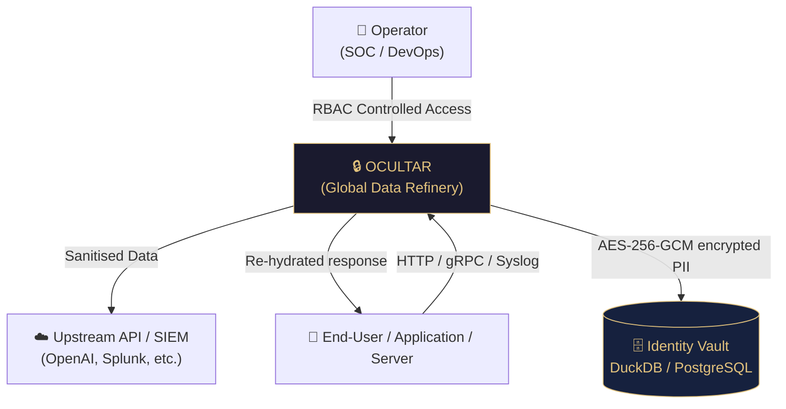
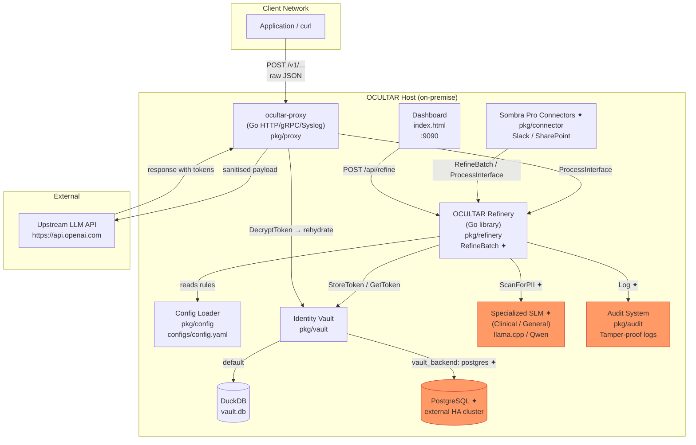
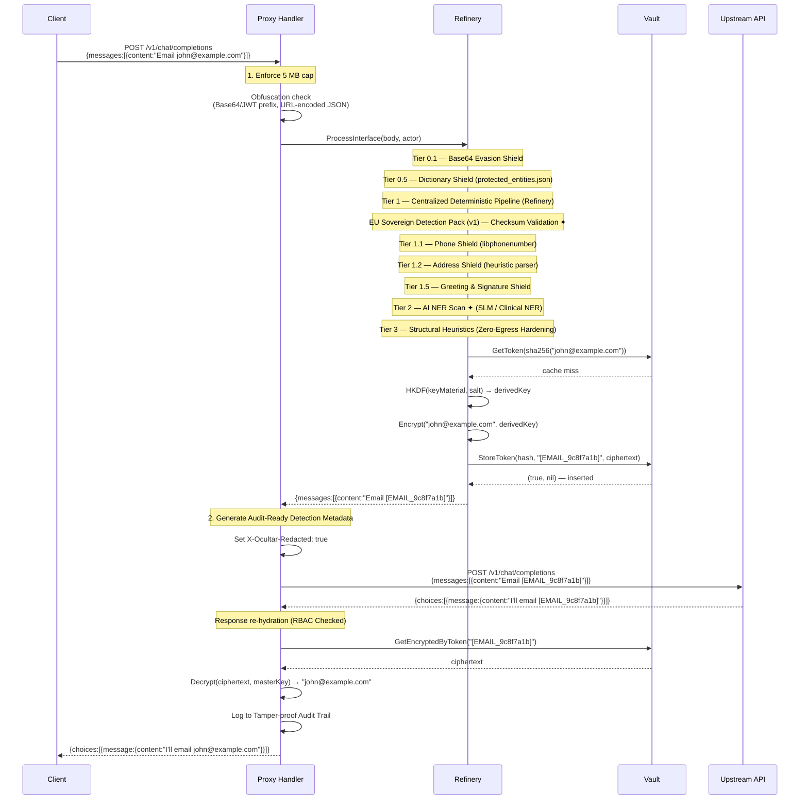
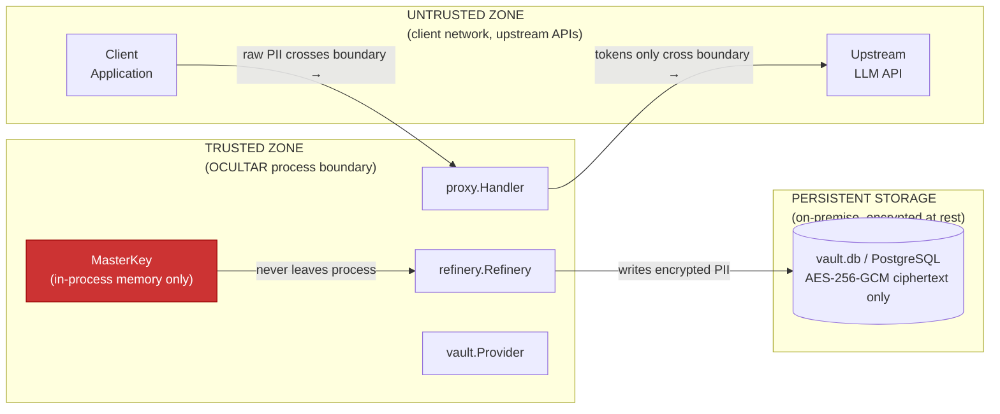
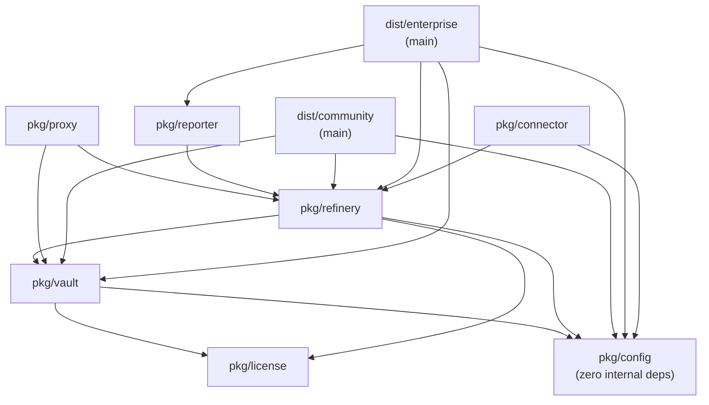

# OCULTAR | Architecture Reference

> **Audience:** Solutions architects, security auditors, and developers who need a precise understanding of how OCULTAR processes data, where trust boundaries lie, and how components interact.

---

## Table of Contents

1. [System Context (C4 Level 1)](#1-system-context-c4-level-1)
2. [Container Diagram (C4 Level 2)](#2-container-diagram-c4-level-2)
3. [Refinery Pipeline — Data Flow](#3-refinery-pipeline--data-flow)
4. [AI-Driven Governance & Orchestration](#4-ai-driven-governance--orchestration)
5. [Security Trust Boundaries](#5-security-trust-boundaries)
6. [Package Dependency Graph](#6-package-dependency-graph)
7. [Cryptographic Design](#7-cryptographic-design)
8. [Vault Schema](#8-vault-schema)
9. [Fail-Closed Guarantees](#9-fail-closed-guarantees)
10. [Scalability & Concurrency Model](#10-scalability--concurrency-model)

---

## 1. System Context (C4 Level 1)

Who uses OCULTAR, and what external systems does it touch?



**Zero-Egress guarantee:** PII never flows to `Upstream API` — only tokens do. The vault lives entirely on-premise.

---

## 2. Container Diagram (C4 Level 2)

Internal services and how they communicate:


*✦ = Enterprise only*

---

## 3. Refinery Pipeline — Data Flow

A single request through the OCULTAR proxy, showing every processing step:



---

## 4. AI-Driven Governance & Orchestration

Ocultar uses a decentralized network of **Specialized Agent Skills** to maintain security, compliance, and product integrity. These are orchestrated by the `Continuous AI Orchestrator`.

### Governance Tiers (v2.1)

| Tier | Agent Skills | Focus |
|---|---|---|
| **Core Orchestration** | `continuous-ai-orchestrator`, `ai-development-protocol`, `ecosystem-state-tracker`, `repository-knowledge-map` | The master-switch; manages the execution DAG and ensures state-persistence across skill runs. |
| **Compliance & Intent** | `regulatory-intent-decoder`, `regulation-digest-ingestor`, `policy-schema-generator`, `compliance-integrity-suite`, `compliance-certificate-signer` | The "Legal-to-Technical" refinery; decodes regulations and signs technical evidence. |
| **Security & Egress** | `zero-egress-validator`, `refinery-architecture-manager`, `secret-scanner`, `secret-rotation-manager`, `red-team-evasion-scanner`, `pii-regression-suite-runner` | The "Fail-Closed" layer; automates PII detection rules and detects "Shadow AI" adoption. |
| **Business & Infrastructure** | `manage-ocultar-license`, `license-validation-cli`, `tier-compliance-checker`, `pilot-manager`, `roi-cost-efficiency-accountant`, `sombra-gateway-policy-enforcer` | The "Value Layer"; manages Ed25519 licensing, Pilot lifecycles, and financial ROI quantification. |

### The 16-Step Ocultar Protocol
The orchestrator triggers a deterministic sequence for ALL repository modifications:
1. **Ingest** (Regs) → 2. **Decode** (Intent) → 3. **Sync** (State) → 4. **Generate** (Policy) → 5. **Simulate** (Impact) → 6. **Sign** (Artifact) → 7. **Audit** (Log check) → 8. **Enforce** (Gateway) → 9. **Verify** (Dash) → 10. **Redact** (Content) → 11. **Scan** (Secrets) → 12. **Visualize** (CIV) → 13. **Red-Team** (Evasion) → 14. **Provision** (Snapshot) → 15. **Account** (ROI) → 16. **Benchmark** (Perf).

---

## 5. Security Trust Boundaries



**What NEVER leaves the trusted zone:**
- Plain-text PII
- The `OCU_MASTER_KEY` value
- Decrypted vault contents

**What MAY leave the trusted zone:**
- Token strings (e.g. `[EMAIL_9c8f7a1b]`) — these are safe; reversible only with the vault + master key.
- Structured audit log entries (token strings only, never PII).

---

## 5. Package Dependency Graph



**Key architecture rules:**
1. `pkg/config` has zero internal dependencies — it is the root of the dependency tree.
2. `pkg/refinery` does **not** import `pkg/proxy` — the refinery knows nothing about HTTP.
3. `pkg/vault` does **not** import `pkg/refinery` — storage is decoupled from redaction logic.

---

## 6. Cryptographic Design

### Key Derivation

```
OCU_MASTER_KEY (env var, arbitrary string)
        │
        ▼
   HKDF-SHA256(keyMaterial, salt, info)
        │
        ▼
   32-byte AES key  ──► used for Encrypt() / Decrypt()
```

The Sombra gateway uses **HKDF** (SHA-256, fixed salt) instead of raw SHA-256 for stronger key separation.

### License Enforcement (Entitlement Bitmask)
Enterprise licenses (signed via Ed25519) include a 64-bit `Capabilities` mask. This provides granular control over which "Pro" features are enabled for a specific customer.
- **Bit 0 (1)**: Slack Connector
- **Bit 1 (2)**: SharePoint Connector
- **Bitmask 0**: Grants all (legacy/default compatibility)

### Token Generation

```
original PII: "john@example.com"
        │
        ▼
  SHA-256("john@example.com")
  = 9c8f7a1b3f2e4d6a...  (full 64-char hex)
        │
        ├──► Token: [EMAIL_9c8f7a1b]   ← first 8 hex chars of the hash
        │           (stored as plain text — safe to expose)
        │
        └──► Hash (full 64 chars): lookup key in vault
```

**Determinism:** The same PII always produces the same token. This is intentional — it preserves relational integrity across records (two rows with the same email get the same token).

### AES-256-GCM Ciphertext Format

```
hex_encoded(
    random_nonce (12 bytes, crypto/rand)
    ||
    gcm.Seal(nonce, nonce, plaintext, nil)  ← 16-byte auth tag appended by GCM
)
```

Total overhead per PII value: 12 bytes (nonce) + 16 bytes (auth tag) = 28 bytes of overhead, hex-encoded to 56 extra characters on top of the plaintext length.

### Storage Layout

| Column | Type | Content |
|---|---|---|
| `pii_hash` | TEXT (PK) | Full SHA-256 hex of original PII — lookup key |
| `token` | TEXT | `[TYPE_XXXXXXXX]` string — safe to expose |
| `encrypted_pii` | TEXT | Hex-encoded AES-256-GCM ciphertext |

---

## 7. Vault Schema

### DuckDB (default)

```sql
CREATE TABLE IF NOT EXISTS vault (
    pii_hash      TEXT PRIMARY KEY,
    token         TEXT NOT NULL,
    encrypted_pii TEXT NOT NULL
);
```

Single file at `vault.db`. Zero external dependencies. Supports concurrent reads; writes are serialised via DuckDB's MVCC.

### PostgreSQL (Enterprise ✦)

Same schema created at startup via `CREATE TABLE IF NOT EXISTS`. Connection string via `postgres_dsn` in `config.yaml`. Connection pool capped at 15 (`sync.Semaphore` in `pkg/proxy`) to prevent exhaustion.

---

## 8. Fail-Closed Guarantees

OCULTAR enforces fail-closed at every critical junction:

| Failure scenario | OCULTAR behaviour |
|---|---|
| `protected_entities.json` missing or empty | `log.Fatal` — process refuses to start |
| `configs/config.yaml` contains invalid regex | `regexp.MustCompile` panics at startup — process refuses to start |
| Refinery error during redaction (any tier) | Proxy returns `500` — un-redacted body is **never forwarded** |
| Trial limit reached (`OCU_PILOT_MODE`) | Proxy returns `403` — request is blocked |
| Obfuscated payload detected (Base64/JWT prefix, URL-encoded JSON) | Refinery returns error → proxy returns `403` |
| SSRF attempt in `Ocultar-Target` header | `resolveTarget` returns error → proxy returns `403` |
| Payload exceeds 5 MB | `MaxBytesReader` triggers → proxy returns `413` |
| Concurrency limit exceeded (>15 concurrent) | Semaphore blocks for 5 seconds → `429` if not acquired |
| Token re-hydration key mismatch (key rotation) | Logs error, returns **token unchanged** (fail-safe — no data loss) |
| SLM inference fails (Enterprise) | Refinery returns error → proxy returns `500` |
| Pro Connector initialized without Bitmask license | `log.Printf([WARN])` — connector remains dormant (Fail-Closed) |

> **Re-hydration exception:** Unlike request-side processing which is strictly fail-closed, response-side re-hydration is **fail-safe** — if a token cannot be decrypted (e.g. after a key rotation), the token is returned as-is rather than returning a 500 error. This prevents permanent proxy unavailability while preserving security (the token string itself contains no PII).

---

## 9. Scalability & Concurrency Model

### Concurrency limits

| Layer | Mechanism | Limit |
|---|---|---|
| Proxy (per instance) | `chan struct{}` semaphore | 15 concurrent requests |
| DuckDB | File-level lock | Single-process only |
| PostgreSQL (Enterprise) | Connection pool (15 max) | Horizontally scalable |

### Horizontal scaling

| Mode | Scalable? | Notes |
|---|---|---|
| CLI / Dashboard | ✅ (per-process) | Each process uses its own `vault.db` — sharding by node. |
| Proxy (DuckDB) | ❌ | Single-node only; multiple proxy instances would use separate vaults. |
| Proxy (PostgreSQL ✦) | ✅ | Multiple proxy instances can share a single PostgreSQL vault. Load-balance freely. |

### Memory model

- **Request bodies** are read fully into RAM before processing (5 MB cap enforced via `io.MaxBytesReader`).
- **File uploads** (`/api/refine/file`) use `bufio.Scanner` — line-by-line streaming. Memory overhead is bounded to a single line, not the file size.
- **SLM batch scan** marshals an entire JSON record to a string once per document — for deeply nested objects, worst-case memory is 2× the JSON document size.
- **Vault hits map** (`refinery.Hits`) is accumulated per-request and protected by `sync.Mutex`. It is reset between requests via `ResetHits()`.
